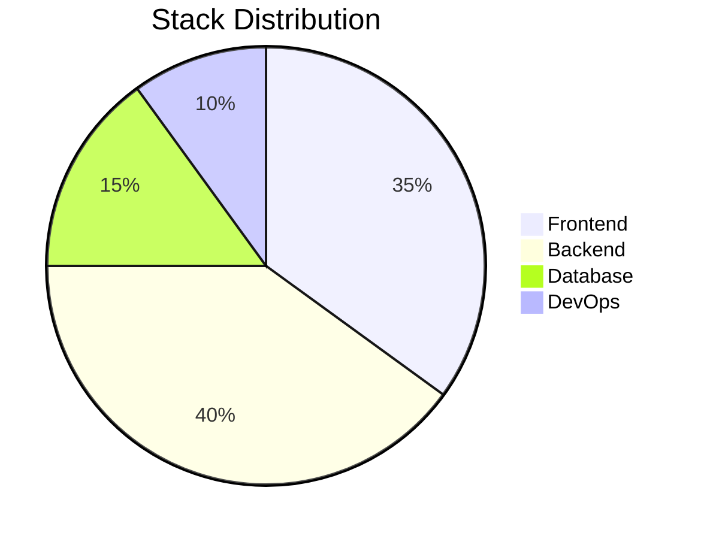

# 👋 Hola, soy Job Natanael Contreras Garzón

### 💻 Desarrollador Full Stack | Apasionado por crear soluciones escalables y elegantes

Desarrollador Full Stack con experiencia en **React**, **Next.js**, **Django** y **Spring Boot**. Me especializo en construir interfaces modernas y APIs robustas, siempre orientado a las buenas prácticas, el trabajo en equipo y el aprendizaje continuo.

---

## 🚀 Sobre mí

- 🔭 Actualmente trabajo en proyectos Full Stack con arquitecturas cliente-servidor
- 🌱 Aprendiendo constantemente nuevas tecnologías y mejores prácticas
- 👯 Busco colaborar en proyectos de código abierto
- 💼 Objetivo: **Junior Developer** enfocado en desarrollo Full Stack
- 🎯 Apasionado por el diseño de arquitecturas escalables y la optimización de rendimiento
- 📚 Metodologías: SCRUM, RUP/PUDS

---

## 🛠️ Stack Tecnológico

### Frontend


### Backend


### Bases de Datos


### Herramientas & DevOps


### Otros Lenguajes


---

## 💼 Experiencia en Proyectos

### 🌐 Sistemas Web Full Stack
- Desarrollo de aplicaciones web completas con arquitectura cliente-servidor
- Implementación de APIs RESTful con autenticación y autorización
- Integración de bases de datos relacionales y no relacionales

### ⚛️ Aplicaciones con Frameworks Modernos
- Desarrollo de SPAs (Single Page Applications) con React y Angular
- Implementación de SSR (Server Side Rendering) con Next.js
- Diseño responsive y optimización de rendimiento

### 🔧 Backend Robusto
- Creación de microservicios con Spring Boot
- APIs escalables con Django y FastAPI
- Gestión de migraciones y modelado de bases de datos

---

## 📊 Estadísticas de GitHub

<p align="center">
  
</p>

<p align="center">
  
</p>

<p align="center">
  
</p>

---
## 🎯 Tech Stack & Skills

<div align="center">


### 🚀 Lo que domino

</div>

<table align="center">
<tr>
<td align="center" width="25%">

<br><strong>React</strong>
</td>
<td align="center" width="25%">

<br><strong>Python</strong>
</td>
<td align="center" width="25%">

<br><strong>Java</strong>
</td>
<td align="center" width="25%">

<br><strong>TypeScript</strong>
</td>
</tr>

<tr>
<td align="center" width="25%">

<br><strong>Django</strong>
</td>
<td align="center" width="25%">

<br><strong>MySQL</strong>
</td>
<td align="center" width="25%">

<br><strong>GitHub</strong>
</td>
<td align="center" width="25%">

<br><strong>Docker</strong>
</td>
</tr>
</table>

<div align="center">

### 📊 Distribución de Skills



</div>

---

<div align="center">

### 💼 Experiencia en...

| 🎨 Frontend | ⚙️ Backend | 💾 Database | 🛠️ Tools |
|------------|-----------|------------|---------|
| React ⚛️ | Django 🐍 | PostgreSQL 🐘 | Git 📦 |
| Next.js ▲ | FastAPI ⚡ | MySQL 🐬 | GitHub 🐙 |
| Angular 🅰️ | Spring Boot ☕ | Supabase ⚡ | Vercel ▲ |
| Flutter 📱 | Node.js 🟢 | Firebase 🔥 | Heroku 💜 |

</div>

```

---

## 🌍 Idiomas

- 🇪🇸 **Español**: Nativo
- 🇬🇧 **Inglés**: Técnico (Intermedio) - Lectura técnica y comunicación básica

---

## 📫 Conecta conmigo

<p align="left">
<!-- Agrega aquí tus redes sociales -->
<a href="https://www.linkedin.com/in/job-natanael-contreras-garzon" target="_blank">
  
</a>
<a href="mailto:contrerasjob123@gmail.com">
  
</a>
<a href="https://twitter.com/tu-usuario" target="_blank">
  
</a>
</p>

---

## 🎓 Objetivo Profesional

> Busco una posición como **Junior Developer** donde pueda aplicar mis conocimientos en desarrollo Full Stack, contribuir al éxito de proyectos tecnológicos y continuar mi crecimiento profesional. Estoy comprometido con el aprendizaje continuo, las buenas prácticas de desarrollo y el trabajo en equipo para crear soluciones de software de calidad.

---

<p align="center">
  
</p>

<p align="center">
  💡 <i>"El código limpio siempre parece escrito por alguien a quien le importa" - Robert C. Martin</i>
</p>

---

⭐️ From [Job-Natanael-Contreras-Garzon](https://github.com/Job-Natanael-Contreras-Garzon)
